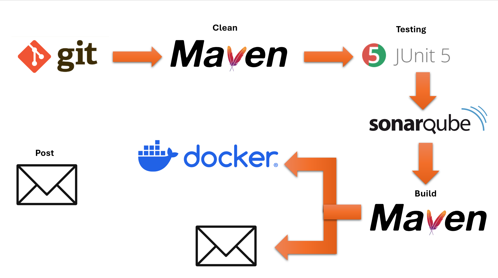

# Jenkins Pipeline Project
This is a pipeline project implemented with Jenkins. The pipeline is created using a declarative approach and implements the following:

Maven clean -> Unit test -> Static code analysis -> maven install -> Build and deploy Docker image to Docker Hub -> Notifications

The pipeline builds the Dash Math project, which can be found at https://github.com/nchinling/mental-math-game
